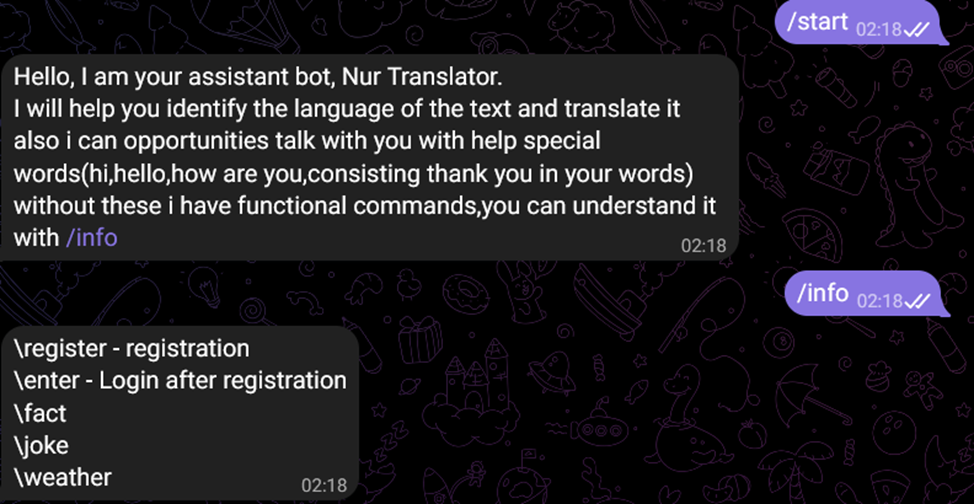

<div align="center">

# 🌐 Multilingual Language Auto-Identifier

**A hybrid Telegram bot & web application for automatic language detection and text translation**


</div>

---

## 📖 Description

**Multilingual Language Auto-Identifier** is a hybrid solution combining a **Telegram bot** and a **web interface** powered by a REST API for automatic language detection and translation of medium-sized texts.

The system identifies the language of any input text with **high accuracy** using correlation-based analysis, covering **200+ languages** worldwide. Each detected language is presented along with its confidence rate, giving users precise insight into which words belong to which languages.

> 💡 Whether you're a linguist, developer, or just curious — this tool makes language identification instant and reliable.

---

## 🛠️ Tech Stack

### Backend
| Technology | Purpose |
|---|---|
| **Python 3.12.7** | Core language |
| **FastAPI** | REST API framework & backend logic |
| **Langbly** | Language detection & translation |
| **Pycountry** | Language code conversion (ISO standards) |
| **Telebot** | Telegram bot integration |
| **requests** | HTTP client for REST API calls |
| **re** | Regular expressions for string parsing |
| **threading** | Runs bot and server simultaneously |

### Frontend
| Technology | Purpose |
|---|---|
| **HTML / CSS** | Page structure and layout |
| **JavaScript** | Frontend–backend data transfer |
| **Bootstrap** | Responsive page styling |

### Database
| Technology | Purpose |
|---|---|
| **PostgreSQL** | Primary database (via **Supabase** ORM) |

---

## ⚙️ Installation

**1. Clone the repository**
```bash
git clone https://github.com/your-username/multilingual-language-auto-identifier.git
cd multilingual-language-auto-identifier
```

**2. Create a virtual environment**
```bash
python -m venv venv
```

**3. Activate the virtual environment**

- Windows:
```bash
venv\Scripts\activate
```
- macOS / Linux:
```bash
source venv/bin/activate
```

**4. Install dependencies**
```bash
pip install -r requirements.txt
```

**5. Configure environment variables**
```
TELEGRAM_TOKEN=your_telegram_bot_token
DATABASE_URL=your_supabase_postgresql_url
```

---

## 🚀 Running the Project

The project consists of two parts that run in parallel: the **FastAPI backend** and the **Telegram bot**.

### Start the FastAPI server

```bash
cd fastapi_back
uvicorn fast:app --reload
```

The API will be available at: `http://127.0.0.1:8000`  
Interactive docs: `http://127.0.0.1:8000/docs`

### Start the Telegram bot

Open a second terminal window:

```bash
cd telegram_bot
python telegram_agent.py
```

> ⚡ Both processes run simultaneously thanks to the `threading` module — you can also configure it to launch both from a single entry point.

---

## 💬 Chatbot Usage Examples

Send any text to the bot in Telegram and it will instantly return:

**Example 1 — Single language text**
```
User:  Привет,как дела?
Bot:   🌍 Detected language: Russian (ru)
       Translate: Hello, how are you?
       📊 Confidence: 99.2%
       🔤 Translation (if requested): —
```
**Example 2 — other commands and scripts**
```
User:  [Hello,hi]
Bot: Hi,how are you?
```
```
User:  [how are you?,how is it going?]
Bot: I am fine,thank you,and you?
```
```
User:  [consisting 'thank you' in words]
Bot: you're welcome!
```

**Example 3 — other commands and scripts**
```
User:  /joke
Bot: **using joke API**
```
```
User:  /weather
Bot: City:
User: Almaty
Bot: **using weather API for analysing**
```
```
User:  /fact
Bot: **using fact ninja API for random facts**
```


---

## 🖼️ Interface Screenshots

> 📌 Screenshots of the web interface and Telegram bot are shown below.

### Web Application

<!-- Add your web interface screenshot here -->
```
[ Screenshot placeholder — add your image as /assets/web_interface.png ]
```

### Telegram Bot

```

```

---

## 📁 Project Structure

```
multilingual-language-auto-identifier/
│
├── fastapi_back/
│   ├── fast.py              # FastAPI application entry point
│   
├──  message_api/
│    ├──__init__.py
│    ├── api.py
├── telegram_bot/
│   ├── telegram_agent.py    # Telegram bot entry point
│   └── __init__.py
│
├── frontend/
│   ├── dashboard.html          
│   ├── enter.html           
│   └── register.html          
│
├── requirements.txt         # Python dependencies
└── README.md
```

---


<div align="center">

With code ❤️  we can trust

</div>
